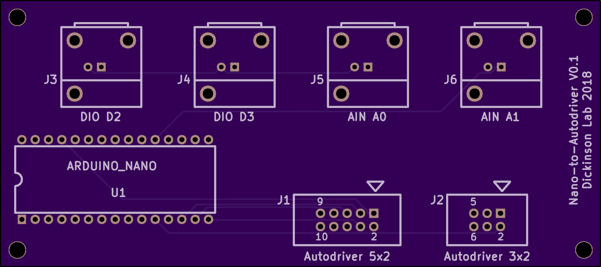
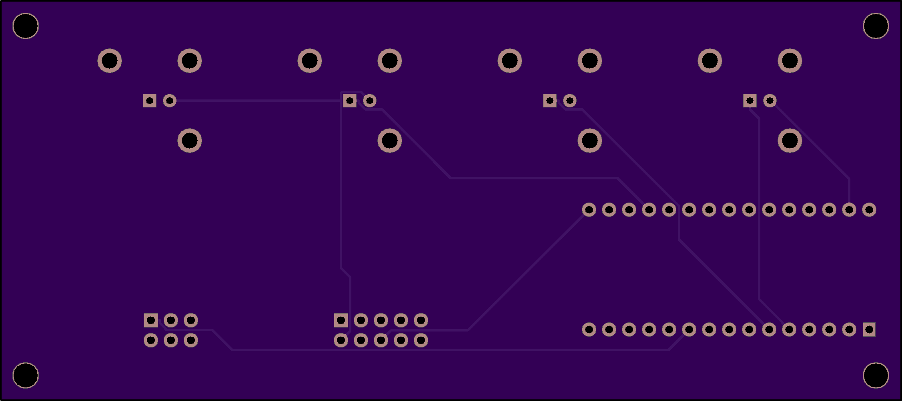

# nano_to_autodriver
A simple PCB for connecting the Arduino Nano to the Sparkfun Autodriver. [Schematic (PDF)](nano_to_autodriver.pdf)

# Top View: 

# Bottom View:

# License: 
Creative Commons Attribution 4.0 International CC BY 4.0

